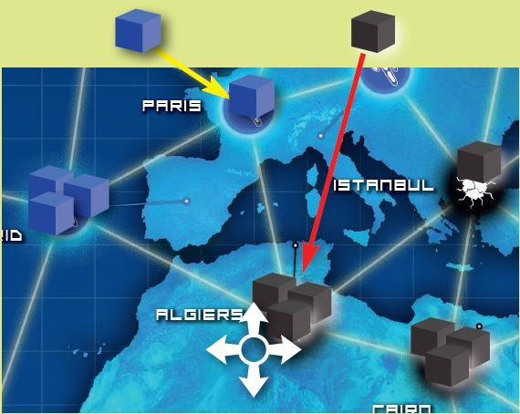
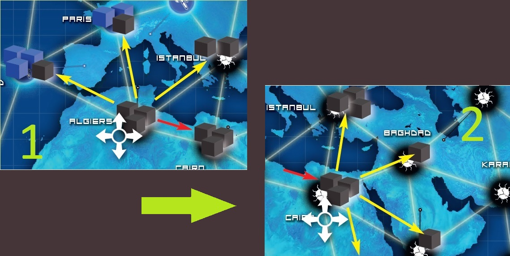
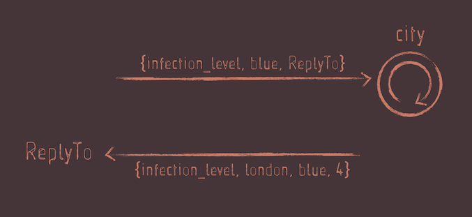
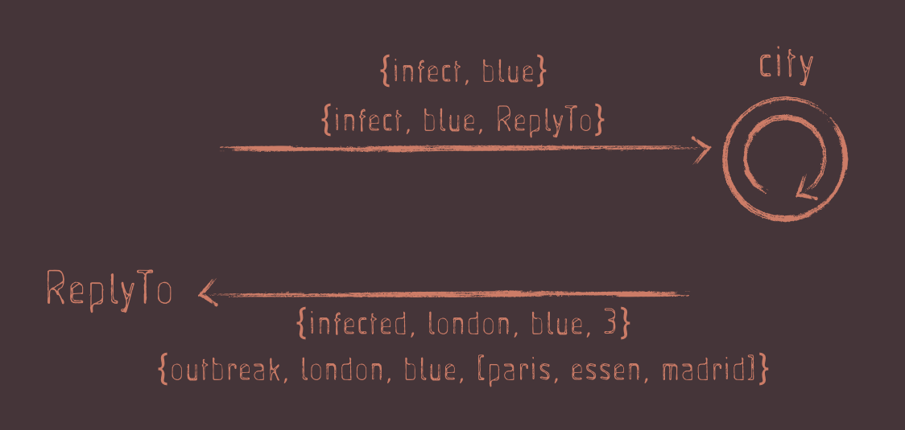

## Erlang microservices <small>since 1987<small>

### Yvan VU @JeSuisSocial
### Arnauld Loyer @aloyer

#HSLIDE

## A BRIEF HISTORY

#VSLIDE

#### 1987 : Erlang's birth
by Joe Armstong, Robert Virding and Mike Williams

#VSLIDE

#### Constraints

- Systems distributed with large number of concurrent activities
- High Availability
- Software maintenance without stopping the system
- Reliability
- Fault tolerance

#VSLIDE

#### Out of the box

- Functional Programming
- Concurrency (Actor Model)
- Supervision
- Client-Server (with OTP)
- Distributed Database
- Erlang Virtual Machine

#HSLIDE

## Pandemic Game

#VSLIDE

#### Infect

- increases a city disease level by 1
- if the disease level is already at 3, an outbreak occurs



#VSLIDE

#### Outbreak 
infect each neighbours in a chain without infecting the same city twice



#HSLIDE

#### Erlang Basics - Shell & Numbers

```bash
$ erl
Erlang/OTP 19 [erts-8.1] [source] [64-bit] [smp:4:4] [async-threads:10] [hipe] [kernel-poll:false]

Eshell V8.1  (abort with ^G)
1> 1+3.
4
2> 123456789 * 123456789 * 123456789 * 123456789.
232305722798259244150093798251441
3> 5/2. 
2.5
4> is_integer(2.5).
false
5> is_float(232305722798259244150093798251441.0).
true
```

#VSLIDE

#### Erlang Basics - Variable

```erlang
6> A = 23.
23
7> 23 = A.
23
8> 23 = B.
* 1: variable 'B' is unbound
9> C.
* 1: variable 'C' is unbound
10> A.
23
11> A = A + 1.
** exception error: no match of right hand side value 24
12> f().
ok
13> A.
* 4: variable 'A' is unbound
```

#VSLIDE

#### Erlang Basics - Atom

```erlang
14> threshold = 12.
** exception error: no match of right hand side value 12
15> true.
true
16> false.
false
17> i_am_an_atom.
i_am_an_atom
```

#VSLIDE

#### Erlang Basics - Tuple

```erlang
18> {ncrafts, paris, france}.
{ncrafts, paris, france}
19> {erlang, 5}.
{erlang, 5}
20> HandsOn = {erlang, 200}.
{erlang, 5}
21> {What, Room} = HandsOn.
erlang,5}
22> What.
erlang
23> Room.
200
```

#VSLIDE

#### Erlang Basics - List

```erlang
24> [paris, essen, madrid].
[paris, essen, madrid]
25> LS = [paris, essen, madrid].
26> [Head | Tail] = LS. 
27> Head.
paris
28> Tail.
[essen, madrid]
29> [First, Second | Remaining] = LS.
30> First.
paris
31> Second.
essen
32> [madrid | Remaining2] = Remaining.
33> Remaining2.
[]
```

#VSLIDE

#### Module

```erlang
-module(calc).
-export([add/2]).
add(A,B) ->
    A+B.
```

#VSLIDE

#### Module

```erlang
-module(calc).
-export([add/2, divide/2]).
add(A,B) ->
    A+B.
    
divide(A,B) ->
    A/B.
```


#VSLIDE

#### Module

```erlang
-module(calc).
-export([add/2, divide/2]).
add(A,B) ->
    A+B.
    
divide(A,0) -> infinity;
divide(A,B) ->
    A/B.
```


#VSLIDE

#### Module

```erlang
-module(calc).
-export([add/2, divide/2]).
add({Ax,Ay},{Bx,By}) ->
    {Ax+Bx, Ay + By};
add(A,B) ->
    A+B.
    
divide(A,0) -> infinity;
divide(A,B) ->
    A/B.
```


#VSLIDE

#### Module

```erlang
-module(calc).
-export([add/1, add/2, divide/2]).

add(Ls) ->
  add(Ls, 0).

add([], Total) -> Total;
add([L|LS], Total) -> 
  add(LS, L + Total);
add({Ax,Ay},{Bx,By}) ->
    {Ax+Bx, Ay + By};
add(A,B) ->
    A+B.
    
divide(A,0) -> infinity;
divide(A,B) ->
    A/B.
```


#HSLIDE

#### City

Create a module `city` with the following functions:

* `new(CityName) -> {ok, City}`
* `name_of(City) -> CityName`
* `infects(City, Disease)`
* `infection_level(City, Disease) -> Level`

#VSLIDE

```
$ mkdir mypandemic
$ cd mypandemic
$ mkdir src && mkdir test
$ touch test/city_test.erl
$ touch src/city.erl
$ <open my ide>
```

#VSLIDE


```erlang
-module(city_tests).

-include_lib("eunit/include/eunit.hrl").

should_not_be_infected_by_default__test() ->
  City = city:new(london),
  ?assertEqual(0, city:infection_level(City, blue)).

should_increase_infection_level_when_infected__test() ->
  City1 = city:new(london),
  City2 = city:infects(City1, blue),
  ?assertEqual(1, city:infection_level(City2, blue)).
```

#VSLIDE

# Your turn!

#VSLIDE

```erlang
-module(city).

%% ------------------------------------------------------------------
%% API Function Exports
%% ------------------------------------------------------------------
-export([new/1, infection_level/2, infects/2]).

%% ------------------------------------------------------------------
%% API Function Definitions
%% ------------------------------------------------------------------
new(CityName) ->
  {CityName, #{}}.

infection_level(City, Disease) ->
  {_CityName, Levels} = City,
  maps:get(Disease, Levels, 0).

infects(City, Disease) ->
  {CityName, Levels} = City,
  Level = maps:get(Disease, Levels, 0),
  NewLevels = Levels#{Disease => Level + 1},
  {CityName, NewLevels}.
```

#VSLIDE

#### Handle outbreak

**But before...**

```erlang
case Value of
  0 -> zero;
  1 -> one;
  2 -> two;
  ping -> pong;
  _ -> i_don_t_know
end
```

#VSLIDE

#### Handle outbreak

When infection level is already at 3, a new infect should cause an **outbreak**

```erlang
infects(City, Disease) -> 
  {infected, NewCity} 
  | outbreak
```

#VSLIDE

#### Handle outbreak - `city_tests`

```erlang
-module(city_tests).

-include_lib("eunit/include/eunit.hrl").

should_not_be_infected_by_default__test() ->
  City = city:new(london),
  ?assertEqual(0, city:infection_level(City, blue)).

should_increase_infection_level_when_infected__test() ->
  City1 = city:new(london),
  {infected, City2} = city:infects(City1, blue),
  ?assertEqual(1, city:infection_level(City2, blue)).

should_outbreak_when_infection_level_reaches_the_threshold__test() ->
  City1 = city:new(london),
  {infected, City2} = city:infects(City1, blue),
  {infected, City3} = city:infects(City2, blue),
  {infected, City4} = city:infects(City3, blue),
  Result = city:infects(City4, blue),
  ?assertEqual(outbreak, Result).
```

#VSLIDE

# Your turn!


#VSLIDE

#### Handle outbreak - `city`

```erlang
-module(city).

-export([new/1, infection_level/2, infects/2]).
-define(THRESHOLD, 3).

new(CityName) ->
  {CityName, #{}}.

infection_level(City, Disease) ->
  {_CityName, Levels} = City,
  maps:get(Disease, Levels, 0).

infects(City, Disease) ->
  {CityName, Levels} = City,
  Level = maps:get(Disease, Levels, 0),
  case Level of
    ?THRESHOLD ->
      outbreak;
    _ ->
      NewLevels = Levels#{Disease => Level + 1},
      {infected, {CityName, NewLevels}}
  end.
```

#HSLIDE

#### Process - Idea

```
1> City1 = city:new(london).
2> {infected, City2} = city:infects(City1, blue).
3> {infected, City3} = city:infects(City2, blue).
4> {infected, City4} = city:infects(City3, blue).
5> 3 = city:infection_level(City4, blue).
```

* Annoying when lot of mutation occurs!!
* How to maintain them all ?


#VSLIDE

#### Process - Idea


```
1> Pid = city_proc:start(london).
2> city:infects(Pid, blue).
3> city:infects(Pid, blue).
4> city:infects(Pid, blue).
5> 3 = city:infection_level(Pid, blue).
```

#VSLIDE

#### Process - Send and Receive message

```erlang
1> Pid = spawn(fun() -> io:format("Hello~n",[]) end).
Hello
<0.59.0>
2> self().
<0.57.0>
3> Pid2 = spawn(fun() ->
    io:format("Hello ~p~n", [self()]),
    receive
      Msg ->
        io:format("Message received ~p~n", [Msg])
    end
end).
Hello <0.62.0>
<0.62.0>
4> Pid2 ! dooooooo.
Message received dooooooo
```

#VSLIDE

#### Process - State Mutation

```erlang
-module(rpl).
-export([start/0, loop/1]).
start() ->
  spawn(?MODULE, loop, [0]).

loop(Count) ->
  io:format("Waiting for message~n"),
  receive
    {infect, What} ->
      NewCount = Count + 1,
      io:format("Erf... i'm infected by ~p: ~p~n", [What, NewCount]),
      loop(NewCount);
    Msg ->
      io:format("Hey: ~p~n", [Msg]),
      loop(Count)
  end.
```

#VSLIDE

#### Process - State Mutation

```
1> c("src/rpl").
{ok,rpl}
2> Pid = rpl:start().
Waiting for message
<0.64.0>
3> Pid!what.
Hey: what
what
Waiting for message
4> Pid!{infect, blue}.
Erf... i'm infected by blue: 1
{infect,blue}
Waiting for message
5> Pid!{infect, red}. 
Erf... i'm infected by red: 2
{infect,red}
Waiting for message

```

#HSLIDE

#### Protocol



```
17> Pid = city_proc:start(london, [paris, essen, madrid]).
<0.102.0>
18> Pid!{infection_level, blue, self()}.                  
{infection_level,blue,<0.99.0>}
19> flush().
Shell got {infection_level,london,blue,0}
ok
20> 
```

#VSLIDE

#### Protocol



```
21> Pid = city_proc:start(london, [paris, essen, madrid]).
<0.102.0>
22> Pid!{infect, blue, self()}.                  
{infect,blue,<0.99.0>}
23> flush().
Shell got {infected,london,blue,2}
ok
24> 
```
#VSLIDE

# Your turn!

#VSLIDE

## `city_proc.erl` 1/2

```erlang
-module(city_proc).

-export([start/2]).
-export([infection_level/2, infects/2, infects/3]).
-export([loop/2]).

start(CityName, Links) ->
  spawn(?MODULE, loop, [city:new(CityName), Links]).

infection_level(City, Disease) ->
  City ! {infection_level, Disease, self()},
  receive
    {infection_level, _, Disease, Level} ->
      {ok, Level};
    Other ->
      {error, Other}
  end.

infects(City, Disease) ->
  City ! {infect, Disease, noreply}.

infects(City, Disease, ReplyTo) ->
  City ! {infect, Disease, ReplyTo}.
```

#VSLIDE

## `city_proc.erl` 2/2

```
loop(City, Links) ->
  receive
    {infection_level, Disease, ReplyTo} ->
      Level = city:infection_level(City, Disease),
      reply(ReplyTo, {infection_level, city:name_of(City), Disease, Level}),
      loop(City, Links);

    {infect, Disease, ReplyTo} ->
      Result = city:infects(City, Disease),
      case Result of
        {infected, NewCity} ->
          Level = city:infection_level(NewCity, Disease),
          reply(ReplyTo, {infected, city:name_of(City), Disease, Level}),
          loop(NewCity, Links);

        outbreak ->
          reply(ReplyTo, {outbreak, city:name_of(City), Disease, Links}),
          loop(City, Links)

      end
  end.

reply(noreply, _Messag) -> ok;
reply(ReplyTo, Message) -> ReplyTo ! Message.
```

#HSLIDE

### Let it crash!

```
1> c("src/city"), c("src/city_proc").
2> Pid = city_proc:start(london, [paris, essen, madrid]).
<0.69.0>
4> Pid!{infect, blue, self()}.
{infect,blue,<0.57.0>}
5> flush().
Shell got {infected,london,blue,1}
ok
6> Pid!{infect, blue, invalid_process_id}.
{infect,blue,invalid_process_id}
7> 
=ERROR REPORT==== 28-Mar-2017::13:34:07 ===
Error in process <0.69.0> with exit value:
{badarg,[{city_proc,loop,2,[{file,"src/city_proc.erl"},{line,44}]}]}
```

#VSLIDE

### `monitor/2`

```
1> Pid = city_proc:start(london, [essen, paris]).
2> monitor(process, Pid).
#Ref<0.0.1.84>
3> Pid!{infect, blue, invalid_process_id}.
{infect,blue,invalid_process_id}
=ERROR REPORT==== 31-Mar-2017::13:39:30 ===
...
4> flush().
Shell got {'DOWN',#Ref<0.0.1.84>,process,<0.59.0>,
                  {badarg,[{city_proc,reply,2,
                                      [{file,"src/city_proc.erl"},{line,64}]},
                           {city_proc,loop,2,
                                      [{file,"src/city_proc.erl"},
                                       {line,53}]}]}}
```

#VSLIDE

### `register/2`

```
1> Pid = city_proc:start(london, [essen, paris]).
<0.59.0>
2> register(london, Pid).
true
3> london!{infect, blue, noreply}.
{infect,blue,noreply}
4> city_proc:infection_level(london, blue).
{ok,1}
5> 
```

#VSLIDE

## Supervisor

Create a module `city_sup` with the following function

* `start(CityName, Link) -> Pid`

Behavior:

* supervisor must restart the city process if it crash
* supervisor registers the city process with the given name

#VSLIDE

# Your turn!


#HSLIDE

### a bit of distribution!


```
→ erl -sname right
```

```
→ erl -sname left

(left@Mentem)1> node().
left@Mentem
(left@Mentem)2> nodes().
[]
(left@Mentem)3> net_adm:ping('right@Mentem').
pong
(left@Mentem)4> nodes().
[right@Mentem]
(left@Mentem)5> 
```

#VSLIDE

#### Terminal `right`

```
(right@Mentem)1> c("src/city.erl"), c("src/city_proc.erl"), c("src/city_sup.erl").
...
(right@Mentem)2> city_sup:start(london, [paris, essen]).                          
<0.104.0>
```

#### Terminal `left`

```
(left@Mentem)5> [Right] = nodes().
(left@Mentem)6> city_proc:infects({london, Right}, blue).
{infect,blue,noreply}
(left@Mentem)7> city_proc:infection_level({london, Right}, blue).
{ok,3}
```